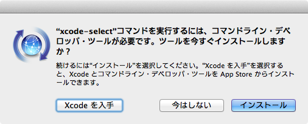
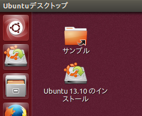

# Perl入学式

# OSについて
## OSとは?
- OSは, Operating System(オペレーティング･システム)の略です.
- 私達のパソコンには, 大抵の場合1つ以上のOSが搭載されていて, OSの上でブラウザなどのアプリケーションが動作しています.
- 代表的なOSとして, 次のようなものが存在します.
    - Windows
    - Mac OS X
    - Linux

## Perlに最適なOSは?
- Perlを利用したWebアプリケーションなどのプログラミングにチャレンジする方は, ｢Windows以外｣のOSを利用することを推奨します.
    - これは, ｢Windows特有のトラブルが多いこと｣, ｢WindowsでPerlを使っているユーザが少なく, トラブル発生時に対処出来る人が少ないこと｣が理由です.
- Perlだけでなく, PHPやRubyでもこの傾向があるように思います.

## Linuxか? Macか?
- Linuxの利点は, 基本的に無料で使えるという点です.
    - 初心者向けのUbuntu, よくサーバで利用されるCentOS, コアな人気を誇るGentooなど, 多くの種類(ディストリビューション)が存在します.
    - Windowsとの共存も可能なので, Windowsユーザの方はひとまずLinuxを使ってみるのがいいのではないでしょうか.

## Linuxか? Macか?
- 基本的にWindows製のソフトウェアはLinux上では動かないと思いましょう.
    - 特にOfficeが使えないのは(場合によっては)致命的となり得ます.
    - WindowsとLinuxを用途に応じて使い分ける必要があるでしょう.

## Linuxか? Macか?
- 一方, MacはMacBook AirやMacBook ProなどApple製のPCに搭載されています.
    - Linuxと同様, 基本的にWindow向けのソフトウェアはMac上では動きません.
    - ただし, Officeについては, MicrosoftがMac版を販売しているので利用することができます.
- その他, ソフトウェアによってはWindowsだけでなくLinuxやMacにも対応したものを配布している場合があります.

## Perl入学式では...
- Windowsユーザの方は...
    - USBメモリを利用して, Ubuntuの環境を構築します.
    - USBを利用すれば, どの環境でもUbuntuを利用することができます.
- Macユーザ, Linuxユーザの方は...
    - 基本的に, 既にお手持ちのPC/環境を利用して頂きます.
    - Macの場合, 後々必要になる可能性が高い｢Xcode｣及び｢Command Line Tools for Xcode｣の導入を行います.

# Xcodeの インストール

〜Macユーザ向け〜

## Xcodeとは?
- Xcodeは, アップルが提供する統合開発環境です.
- Perlを開発する上で, 正確に言えばXcodeは必要ありません.
    - ですが, Perl入学式で利用する｢plenv｣を使ってPerlをインストールする場合, Xcodeからインストールできる｢Command Line Tools for Xcode｣が必要になります.
- ｢Xcode｣も｢Command Line Tools for Xcode｣も, 無料で利用することができます.

## Xcodeのインストール
- XcodeはApple Storeからインストールすることができます. 
    - Apple Storeから｢Xcode｣を検索し, インストールしましょう.
    - インストールには30分程時間がかかります.

 
△Apple Storeのアイコン

## CLT for Xcodeのインストール
- 続いて, Command Line Tools for Xcodeをインストールします.
    - Qiitaの[MavericksでCommand Line Tools for Xcodeをインストールする](http://qiita.com/3yatsu/items/47470091277d46f3fde2)という記事を参考にして, XcodeからCommand Line Tools for Xcodeをインストールしましょう.
- なお, OSのバージョンがMavericksの場合, 次に紹介するターミナルからインストールする方法も利用できます. 

## ターミナルを使う方法
- Launchpadなどから｢ターミナル｣を選択し, 起動します.
    - 今後, 記述したプログラムを実行する作業などは全てターミナルから行います.
    - 頻繁に起動するため, Dockへ追加しておくことをおすすめします.

 
△Ternimalのアイコン

## ターミナルを使う方法
    $ xcode-select --install

- ターミナルに上記のコマンドを打ち込み, Enterキーで入力します.

 
△Command Line Tools for Xcodeを インストールするコマンド

## ターミナルを使う方法
- コマンドを打ち込むとダイアログが表示されるので, あとはダイアログの指示に従ってインストールを進めて下さい.

## CLT for Xcodeのインストール
- 以上でXcodeとCommand Line Tools for Xcodeのインストールは終わりです.
    - お疲れ様でした!

# Ubuntu環境の構築

〜Windowsユーザ向け〜

## Ubuntuとは?
- Canonicalの支援で開発されている, Linuxディストリビューションの1つです.
    - Linux Mintなど, Ubuntuをベースとしたディストリビューションも数多く存在します.
- 比較的, 初心者向けのディストリビューションと呼ばれています.
    - 国内外を問わず, 多くのユーザがUbuntuを利用しています.

## 2種類の方法
- 今回, Perl入学式では｢VMwareを利用する方法｣と｢Bootable USBを利用する方法｣の2種類を紹介します.
    - ｢VMware｣は初心者向け, ｢Bootable USB｣は中級者〜向けの方法と考えています.    
- 今回は, 両方の方法について説明を行いますので, これから説明する各方法のメリット/デメリットを考慮して, どちらの方法を採用するか決定してください.
    - 悩んだ場合, よくわからない場合は, 安全側に倒して｢VMwareを利用する方法｣を選ぶことをおすすめします.

## ｢VMware｣のメリット / デメリット
- メリット
    - Ubuntu環境を構築する為にメモリを用意する必要がありません.
    - これから説明する手順どおりに作業を行えば, 時間は多少かかるもののUbuntu環境を構築することができます.
    - VMwareで構築する仮想マシン(VM)上にUbuntuをインストールするので, 仮想マシンからWindowsに致命的な影響を与えにくいです.
## ｢VMware｣のメリット / デメリット
- デメリット
    - Windowsの上でUbuntuを動かしますので, Ubuntuが動く仮想マシンが利用できる演算資源(メモリ等)については, そのPCが搭載しているものよりも低いスペックになります.

## ｢Bootable USB｣のメリット
- 非常に簡単にUbuntu環境を作ることができます.
    - USBなので, どんなPCでもUbuntu環境を利用することができます.
- VMwareと違い, Windowsを介さず直接Ubuntuを動かすので, CPUやメモリをフル活用出来ます.

## ｢Bootable USB｣のデメリット
- USBを用意する必要があります.
- 誤った操作によって, 既存のWindows環境を破損する可能性はVMwareに比べると高いです.
- データは全てUSBメモリから読み書きされる為, ファイルの読み書きの速度等がUSBメモリの速度に依存します.

## ｢Bootable USB｣のデメリット
- Bootable USBからUbuntuを利用する場合, PCのブートメニュー起動や, そこからのUSBブートなど, 機種固有の動作を行う必要があります.
    - 自習などでPerl入学式サポーターからのサポートを受けられない場合, これらの方法について全て自分で調べる必要があります.
    - 自習の方は, VMwareを利用して環境を構築することをおすすめします.

## ISOの入手

- まず, いずれの場合でも必要になるUbuntuのISOデータを用意しましょう.
    - [http://www.ubuntulinux.jp/download/ja-remix](http://www.ubuntulinux.jp/download/ja-remix)
    - なお今回は, ｢Ubuntu 13.10｣を利用します.
    - 32bit/64bitはお使いのPCのCPUにあわせて選択して下さい.

## Ubuntuのインストール
- USBメモリを利用する方法は[こちら](https://github.com/perl-entrance-org/workshop-2014-01/blob/master/ubuntu_install_usb.md)を参照して下さい.
- VMwareを利用する方法は[こちら](https://github.com/perl-entrance-org/workshop-2014-01/blob/master/ubuntu_install_vmware.md)を参照して下さい.

# ターミナルとシェル入門

## CUI
- MacもUbuntuも, Windowsと同じくGUIで操作可能です.
- ですが, プログラミングをする上でCUIは避けられません.
    - CUI ... Character User Interface
    - 文字によって操作を行うインターフェイスのことを指します.
    - Windowsならば, コマンドプロンプトに該当します.

## CUI
- 基本的なCUIの操作を, 実際に操作しながら体験してみましょう.
    - 一部コマンドはUbuntuのみでしか利用できず, Macのターミナルでは使えませんのでご了承下さい.

## ターミナルとシェル
- ターミナルを開くと, シェルを使った操作が出来るようになります.
    - プログラムの起動や制御をCUIで行うプログラムのことをシェルと呼びます.

## ターミナルの開き方(Ubuntu)

- デスクトップ左上, Ubuntuのロゴが書いてあるボタンをクリックします.

## ターミナルの開き方(Ubuntu)

- テキストボックスに｢terminal｣と入力し, ｢端末｣をクリックして起動します.

## ターミナルの開き方(Mac)

- Launchpadなどから｢ターミナル｣を選択し, 起動します.
    - 再掲ですが, ターミナルは頻繁に起動するため, Dockへ追加しておくことをおすすめします.

 
△ターミナルのアイコン

## シェルで使えるコマンド集
- Perl入学式の中でもよく使うコマンドを紹介します.
    - シェルには, これから紹介する以外にも様々なコマンドがあります.
    - OSやシェルの種類によって使えるもの, 使えないものがありますが, 使いこなせば作業の負担を軽減することができるでしょう.

## コマンド集(ls)
    $ ls
    デスクトップ ダウンロード (以下略)

- `ls`は, 現在居るディレクトリにあるファイルを表示します.
- `ls -a`は, ファイルを**全て**表示します.

## コマンド集(pwd)
    $ pwd
    /home/username

- `pwd`は, 現在居るディレクトリを表示します.

## コマンド集(mkdir)
    $ mkdir sample
    $ ls
    sample デスクトップ ダウンロード (以下略)

- `mkdir DIRECTORY`は, `DIRECTORY`というディレクトリを作ります.

## コマンド集(cd)
    $ cd sample
    $ pwd
    /home/username/sample
    $ cd ..
    $ pwd
    /home/username

- `cd DIRECTORY`は, `DIRECTORY`に移動します.
    - 上のディレクトリは`..`で示します.

## コマンド集(rm)
    $ touch sample1 sample2
    $ ls
    sample1 sample2
    $ rm sample1
    $ ls
    sample2

- `rm [OPTION] FILE`は, `FILE`を削除します.
    - `target file`は半角スペースで区切ることで複数個指定することができます.
- ディレクトリを削除するときは, `[OPTION]`として`-r`を指定し, `rm -r FILE`で削除しなければなりません.
    - `r`は再帰(recursion)を意味します.

## コマンド集(cp)
    $ ls
    sample2
    $ cp sample2 sample1
    $ ls
    sample1 sample2

- `cp [OPTION] SOURCE DEST`は, `SOURCE`を`DEST`にコピーします.
- ディレクトリをコピーするときは, `[OPTION]`として`-r`を指定し, `cp -r SOURCE DEST`でコピーしなければなりません.

## コマンド集(mv)
    $ ls
    sample1 sample2
    $ mv sample1 sample_text
    $ ls
    sample_text sample2

- `mv [OPTION] SOURCE DEST`で, `SOURCE`を`DEST`に移動します.
    - ファイルやディレクトリの名前を変更する為にも使えます.

## コマンド集(nautilus)
    $ nautilus .

- `nautilus DIRECTORY`で, `DIRECTORY`をnautilusというファイルマネージャで開きます.
- 現在のディレクトリは`.`です.
- Macにはnautilusが搭載されていないので, 使えません.

## コマンド集(open)
    $ open .

- `open DIRECTORY`で, `DIRECTORY`をFinderというファイルマネージャで開きます.
    - `open`は対象となるファイルの種類によって動作が変わります.
    - 例えばディレクトリが対象ならば上記のようにFinderで表示, テキストならばテキストエディタで表示...  という動作をします.
- Ubuntuでは利用できません.

## 練習問題
- ホームディレクトリに`perl-entrance`というディレクトリを作ろう.
- 作った`perl-entrance`ディレクトリに移動しよう.
- カレントディレクトリ(`perl-entrance`)を, `nautilus`もしくは`open`を使って, ファイルマネージャで開いてみよう.

# エディタ入門

## エディタ
- コードを書く時に最も使う道具, それがエディタです.
- プログラミングに特化した様々なエディタが開発されていますが, Perl入学式ではその中でもSublime Text2を紹介します.
    - 特にこだわりのない方はSublime Text2を試してみましょう.
    - もちろん, EmacsやVimなど, 既に使い慣れているエディタがある方はそちらをお使いください.

## インストール for Ubuntu
- [http://www.sublimetext.com/](http://www.sublimetext.com/)へアクセス, サンプルムービー下部の｢Download｣ボタンからダウンロードします.
- ダウンロードしたファイルを右クリックして, `ここに展開する`をクリックします.
- `Sublime Text2`というフォルダができるので, その中の`sublime text`をクリックして起動します.

## インストール for Mac
- [http://www.sublimetext.com/](http://www.sublimetext.com/)へアクセス, サンプルムービー下部の｢Download｣ボタンからダウンロードします.
- ダウンロードした｢Sublime Text 2.x.x.dmg｣(xは任意の数字)をダブルクリックし, 開いたウィンドウにある｢Sublime Text 2.app｣を｢Application｣にドラッグすればインストールは完了です.

 
△｢Sublime Text 2.x.x.dmg｣ダブルクリック後の画面

## インストール for Mac
- Finderの｢アプリケーション｣から, ｢Sublime Text 2.app｣をダブルクリックして起動します.
- これから頻繁に利用するので, Dockに登録しておくことをおすすめします.

## 練習問題
- Sublime Text2など, 好きなエディタで`perl-entrance`ディレクトリに`profile.txt`というファイルを用意しましょう.
    - ファイルの中には, あなたの自己紹介を書きます.
- ターミナルを使って, `profile.txt`を`profile2.txt`という名前でコピーしよう.
- コピーした`profile2.txt`をターミナルから削除しよう.

