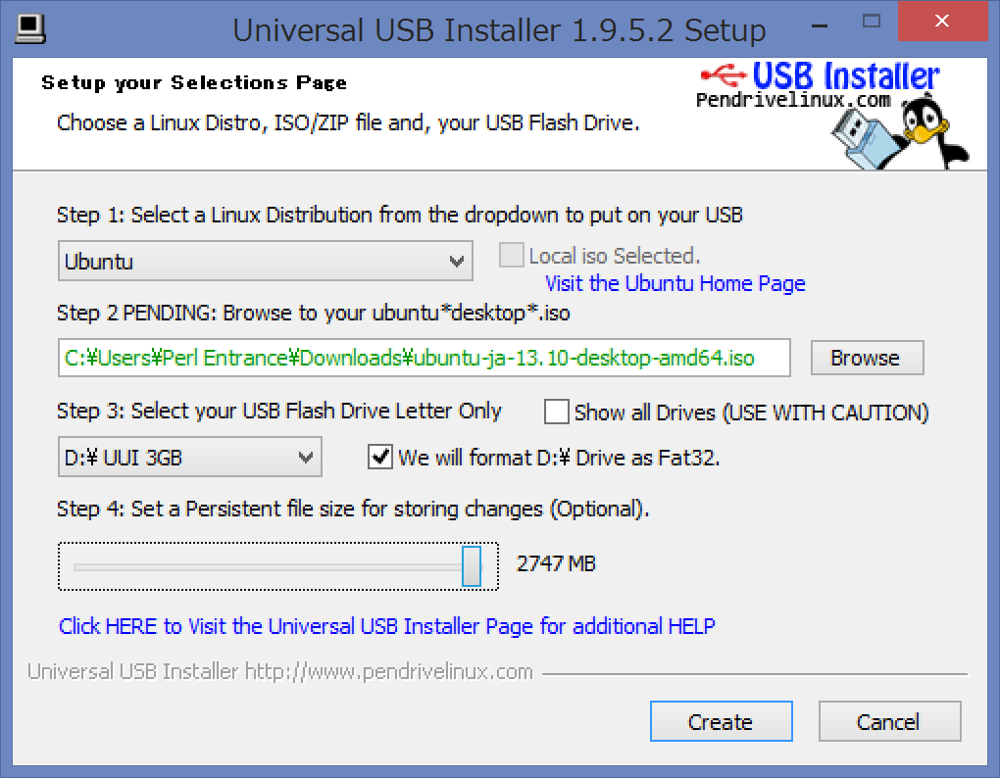

# Ubuntu環境の構築

〜Ubuntu Bootable USB〜

## Ubuntu Bootable USBを利用する方法
- まず, WindowsからUbuntuを起動することができるBootable USBの作成方法について解説します.
- Bootable USBを使うことで, Ubuntuの環境をお手軽に用意し, お手軽に試すことができます.
    - Ubuntu Bootable USBをWindows PCに差し込めば, どこでもUbuntuを実行することができます.
- また, 今回は説明を省きますが, HDDにWindowsとUbuntuをインストールして併用する｢デュアルブート｣の環境を設定する際にも, Bootable USBが必要となります.

## 注意!
- 前述の通り, ｢Ubuntu Bootable USB｣を利用する方法は, 間違った操作によってWindowsを破壊する可能性が｢VMware｣を利用する方法より高いです.
- 特に, 初回起動時に｢Ubuntuのインストール｣を押して, HDDにUbuntuをインストールを進めてしまうと, 既にインストール済みのWindowsを上書きしてUbuntuをインストールしてしまいます.
    - **デスクトップ上や, デスクトップ左側にある｢Ubuntuのインストール｣は絶対に選択しないで下さい!**
    - 資料に基づいて, ｢Ubuntuのインストール｣を削除することを推奨します.

## UUIの入手

- WindowsでUbuntuのBootable USBを作るためのソフトウェア, ｢Universal USB Installer｣を入手します.
    - 略して｢UUI｣.
    - [http://www.pendrivelinux.com/universal-usb-installer-easy-as-1-2-3/]

 
△UUIのダウンロードリンク

## USBメモリの用意

- Ubuntu環境を構築するUSBメモリを用意し, PCに接続します.
    - 既存のデータは, Ubuntu環境の構築によって消える可能性があるため, **予め必ずバックアップを取って下さい.**
    - 可能であれば, フォーマットをかけておくことをおすすめします.

## Bootable USBの作成

- ダウンロードしたUUIを起動します.
- ｢Step 1: Select a Linux ...｣は, ｢Ubuntu｣を選択します.
- ｢Step 2 PENDING: Browse to your ...｣は, ｢Browse｣を選択して, ダウンロード済みのUbuntuのISOを選択します.
- ｢Step 3: Select your USB ...｣は, Ubuntuの環境を構築するUSBメモリを選択してください.
    - ｢We will format ...｣のチェックボックスを選択します.
    - このとき, ｢Show all Drives｣のチェックボックスは**絶対に選択しないでください.**
- ｢Step 4: Set a Persistent file size ...｣は, 適当な数値に設定しておきます(1024MB以上にしておくことを推奨します).

## Bootable USBの作成

- 問題なければ｢Create｣を選択します.
- 次に出るポップアップは作業内容が表示されます. インストール先がUSBであることを確認しましょう.
    - 問題なければ｢はい (Y)｣をクリックし, 環境構築を開始します.

## Bootable USBの作成

- 作業完了後, ｢Close｣でUUIを終了してから, PCを｢再起動｣します.
    - 再起動時に, Windowsが導入済みのHDD/SSDではなく, Ubuntu環境が構築されたUSBメモリを読み込むことによって, USBメモリに構築したUbuntu環境を利用します.
- Ubuntu起動後, デスクトップに｢Ubuntu 13.10のインストール｣というアイコンがありますが, **このアイコンは絶対に起動しないでください.**
    - アイコンをダブルクリックして起動し, Ubuntu 13.10のインストールを進めた場合, **既にHDDに導入済みのWindowsが消去(Ubuntuで上書き)されます.**

## Ubuntuの起動
- 再起動時, ｢F12｣キーなどを連打してブートメニューを開いてください.
    - HDDやUSBメモリなど, どのデバイスから起動するか選択できますので, 作成したBootable USBを選択して下さい.
- ブートメニューが開けない場合(開き方がわからない場合), ｢PCの機種名｣と｢ブートメニュー｣で検索すれば開き方がわかる場合が多いです.
    
## Ubuntuの起動
- 無事にUSBメモリから起動することに成功すれば, ｢GNU GLUB｣というメニューが表示されます.
    - 一番上の選択肢である｢Try Ubuntu without installing｣を選択し, Enterを押して下さい.

## インストール機能の削除
- デスクトップにある｢Ubuntu 13.10のインストール｣を無効にするため, USBからのインストール機能を取り除きます.
    - ｢Ubuntu 13.10のインストール｣アイコンの左上, Ubuntuのロゴが書いてあるボタンをクリックします.

## インストール機能の削除

- テキストボックスに｢terminal｣と入力し, ｢端末｣をクリックして起動します.

## インストール機能の削除

    ubuntu@ubuntu:~$

- この後に, `sudo apt-get remove ubiquity`と入力して, エンターキーを押します.
    - `続行しますか? [Y/n]?`には｢y｣を入力して, エンターキーを押します.
    - これでインストール機能の削除は完了です. デスクトップ上に残った｢Ubuntu 13.10のインストール｣アイコンは削除してしまいましょう.

